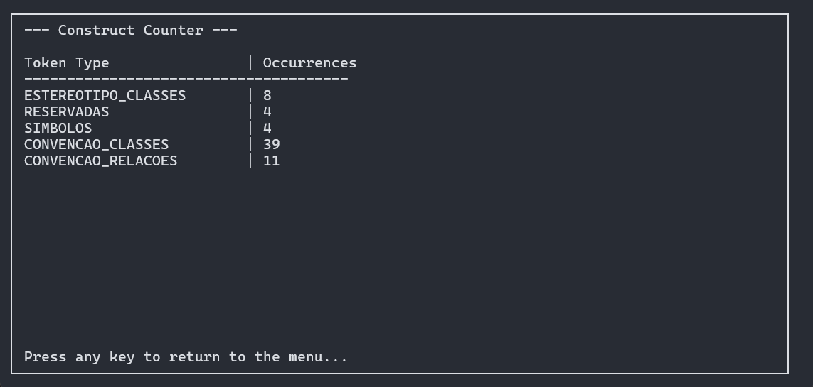
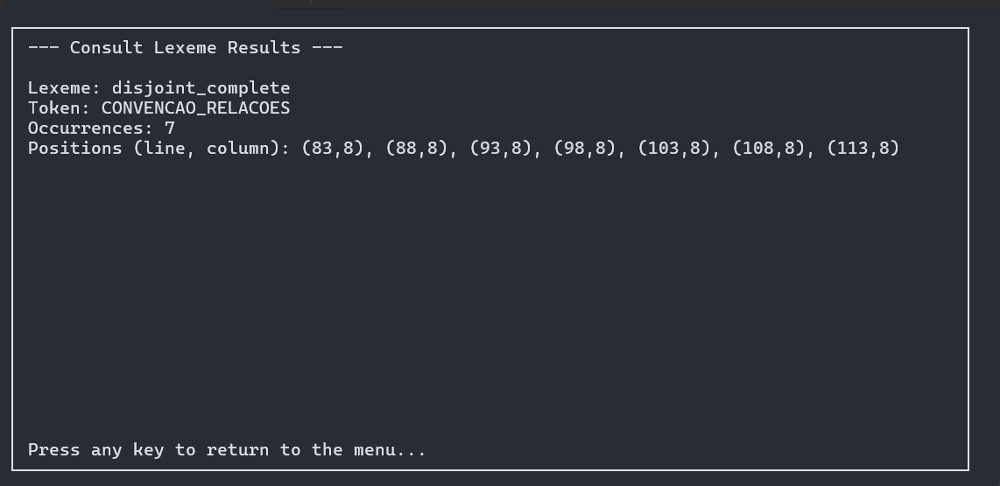

# Sumário

- [Tontopiler](#tontopiler)
- [Tonto](#tonto)
- [Funcionalidades](#funcionalidades)
- [Ferramentas Utilizadas](#ferramentas-utilizadas)
- [Instalação](#instalação)
- [Como Usar](#como-usar)
  - [Contador de Construtos](#contador-de-construtos)
  - [Consultar Lexemas](#consultar-lexemas)
  - [Tabela de Símbolos](#tabela-de-símbolos)
- [Colaboradores](#colaboradores)

# Tontopiler

O Tontopiler é um compilador desenvolvido em C++ para a linguagem Tonto (Textual Ontology Language). Este projeto implementa a primeira fase do processo de compilação, a análise léxica, para a linguagem de ontologia Tonto.

## Tonto

[Tonto](https://github.com/matheuslenke/Tonto), um acrônimo para Textual Ontology Language, é uma linguagem que permite a especificação textual de ontologias como artefatos computacionais. Ontologias são grafos de conhecimento que estabelecem relações de sentido entre conceitos e são, em geral, especificadas em linguagens lógicas como RDF (Resource Description Framework) ou OWL (Web Ontology Language). Elas são fundamentais para a Web 3.0 (ou Web Semântica), onde cada nó do grafo corresponde a um recurso na Web identificado por um URI (Uniform Resource Identifier).

A linguagem Tonto foi proposta para simplificar a modelagem de ontologias, permitindo que especialistas de diversas áreas possam construir modelos computacionais com significado mais profundo. 

## Funcionalidades

O Tontopiler tem como objetivo principal realizar a análise léxica de uma ontologia especificada em Tonto. O analisador léxico oferece duas visualizações principais:

  * **Visão analítica:** Exibe todos os tokens reconhecidos.
  * **Tabela de síntese:** Apresenta um resumo quantitativo dos elementos da linguagem.

Além disso, o analisador trata erros léxicos, indicando a linha onde ocorreram e sugerindo correções com base na especificação da linguagem

## Ferramentas Utilizadas

Lista das ferramentas principais usadas no projeto, com as versões detectadas no ambiente de desenvolvimento onde este repositório foi testado:

- **C++** (g++): 13.3.0 — Linguagem de programação principal do projeto.
- **Flex**: 2.6.4 — Ferramenta para geração de analisadores léxicos.
- **Ncurses** (ncurses-config): 6.4.20240113 — Biblioteca para a criação de interfaces de usuário em modo texto (TUI).
- **CMake**: 3.28.3 — Sistema de automação de compilação.
- **Make**: GNU Make 4.3
- **git**: 2.43.0

## Instalação

Para compilar e executar o projeto, siga os passos abaixo:

1.  **Instale a ferramentas necessárias:**

    - No Ubuntu/Debian:

      ```bash
      sudo apt-get update
      sudo apt-get install build-essential cmake flex libncurses5-dev
      ```

    - No Fedora:

      ```bash
      sudo dnf install @development-tools cmake flex ncurses-devel
      ```

2.  **Clone o repositório:**

    ```bash
    git clone https://github.com/lauramoroni/tontopiler.git
    cd tontopiler
    ```

3.  **Execute o CMake e o Make:**

    ```bash
    cd build/
    cmake ..
    make
    ```

## Como Usar

Após a compilação, um executável chamado `tontopiler` será criado no diretório `build`. Para executá-lo, utilize o seguinte comando:

```bash
./tontopiler
```

O programa iniciará uma interface de usuário em modo texto (TUI) que permite navegar pelos diretórios, selecionar um arquivo `.tonto` para análise e visualizar os resultados. 


A análise léxica gera um arquivo `symbol_table.tsv` com a tabela de símbolos.


No menu principal, você pode escolher entre as seguintes opções:


### Contador de Construtos

Após a análise, o Tontopiler exibe um resumo dos construtos da linguagem existentes no arquivo Tonto analisado.



### Consultar Lexemas

O Tontopiler permite consultar lexemas específicos na tabela de símbolos, exibindo detalhes como token, ocorrências e posições (linha, coluna).



### Tabela de Símbolos

A tabela de símbolos é salva em um arquivo `symbol_table.tsv` no formato TSV (Tab-Separated Values). Ela contém as seguintes colunas:
- Lexeme: O lexema reconhecido.
- Token: O tipo de token associado ao lexema.
- Occurrences: O número de vezes que o lexema aparece no arquivo.
- Positions (line, column): As posições (linha, coluna) onde o lexema foi encontrado.


# Análise Léxica
## O que é o Flex?
[Flex](https://westes.github.io/flex/manual/) (Fast Lexical Analyzer Generator) é uma ferramenta de código aberto utilizada para gerar analisadores léxicos, também conhecidos como scanners ou tokenizers. A partir de um arquivo de entrada com especificações de padrões (expressões regulares) e ações correspondentes em código C, o Flex gera um arquivo de código-fonte em C que implementa o analisador léxico. Este analisador é capaz de reconhecer padrões em um texto de entrada e dividi-lo em uma sequência de tokens, que são as unidades léxicas fundamentais de uma linguagem de programação.

## Como Funciona a Análise Léxica?
A análise léxica é a primeira fase de um compilador. O analisador léxico, lê o código-fonte como uma sequência de caracteres e a transforma em uma sequência de **tokens**. Cada token representa uma unidade lexicalmente significativa da linguagem, como palavras-chave, identificadores, operadores, números e símbolos.

O processo envolve as seguintes etapas:

- Leitura do código-fonte: O analisador lê o código-fonte caractere por caractere.

- Reconhecimento de padrões: Utilizando **expressões regulares**, o analisador identifica sequências de caracteres que correspondem aos padrões dos tokens da linguagem.

- Geração de tokens: Para cada padrão reconhecido (lexema), o analisador léxico gera um token correspondente.

- Descarte de irrelevantes: Espaços em branco, comentários e outros elementos que não fazem parte da estrutura da linguagem são geralmente ignorados.

- Tabela de símbolos: O analisador léxico interage com uma tabela de símbolos para armazenar informações sobre os identificadores encontrados no código.

A saída da análise léxica é uma sequência de tokens que será utilizada pela próxima fase do compilador, a análise sintática.

## Definição dos Construtos para a Linguagem Tonto
Seguindo a estrutura do Flex, os construtos da linguagem Tonto foram definidos no arquivo `lexer.l` utilizando expressões regulares.

- Estereótipos de Classe (**ESTEREOTIPO_CLASSES**): Foram definidos listando todas as palavras-chave que representam estereótipos de classe.

- Palavras Reservadas (**RESERVADAS**): Palavras como genset, disjoint, complete, general, specifics e package.

- Nomes de Classes (**convencaoIdentificador**): Devem começar com uma letra maiúscula, seguida por letras ou sublinhados. Por exemplo: Person, Living_Person.

- Nomes de Relações (**convencaoRelacoes**): Devem começar com uma letra minúscula.

- Nomes de Instâncias (**convencaoInstancias**): Podem começar com qualquer letra e devem terminar com um número.

- Símbolos Especiais (**SIMBOLOS**): Símbolos como `{`, `}`, `(`, `)`, `[`, `]`, `,` e `...`.

- Tratamento de Erros (**TOKEN_DESCONHECIDO**): Qualquer caractere ou sequência de caracteres que não se encaixe em nenhum dos padrões definidos é tratado como um erro léxico.

Cada vez que um padrão é reconhecido, o lexema correspondente é inserido na tabela de símbolos, juntamente com o seu tipo de token, número da linha e coluna onde foi encontrado.

## Colaboradores

- [Laura Moroni](https://github.com/lauramoroni)
- [Paulo Andrade](https://github.com/andrade-paulo)
